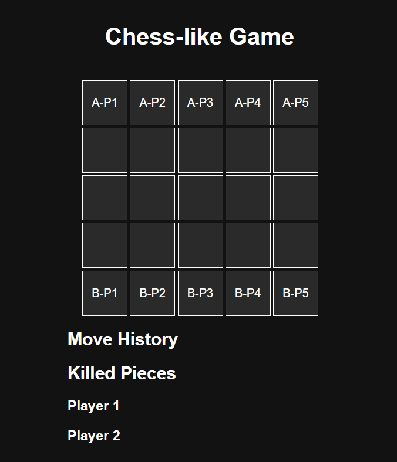

# Basic Chess-Like Game with WebSocket Communication
# HitWicket 
## Overview

This project implements a turn-based chess-like game with real-time communication using WebSockets. The game is played on a 5x5 grid where two players each control a team of five characters. The game features a server-client architecture with a web-based user interface.



## Components

1. **Server**
   - Implements the core game logic.
   - Manages real-time communication with clients via WebSocket.
   - Processes game moves and maintains the game state.

2. **WebSocket Layer**
   - Handles events for game initialization, moves, and state updates.
   - Manages real-time communication between server and clients.

3. **Web Client**
   - Displays the game board and current game state.
   - Provides interactive controls for players.
   - Implements WebSocket communication to send and receive game updates.

## Game Rules

### Game Setup
- Played on a 5x5 grid.
- Each player controls a team of 5 characters: Pawns, Hero1, and Hero2.
- Characters are arranged on the starting rows at the beginning of the game.

### Characters and Movement
1. **Pawn**
   - Moves one block in any direction (Left, Right, Forward, Backward).
   - Move commands: `L`, `R`, `F`, `B`.

2. **Hero1**
   - Moves two blocks straight in any direction.
   - Kills any opponent's character in its path.
   - Move commands: `L`, `R`, `F`, `B`.

3. **Hero2**
   - Moves two blocks diagonally in any direction.
   - Kills any opponent's character in its path.
   - Move commands: `FL`, `FR`, `BL`, `BR`.

### Game Flow
- Players deploy characters on their starting row.
- Players alternate turns, making one move per turn.
- Invalid moves must be retried.
- The game ends when one player eliminates all of the opponent's characters.

## Installation

1. Clone the repository:
   ```bash
   git clone github.com/sharmadishant04/DishantSharma_21BIT0365_hitwicket.git
